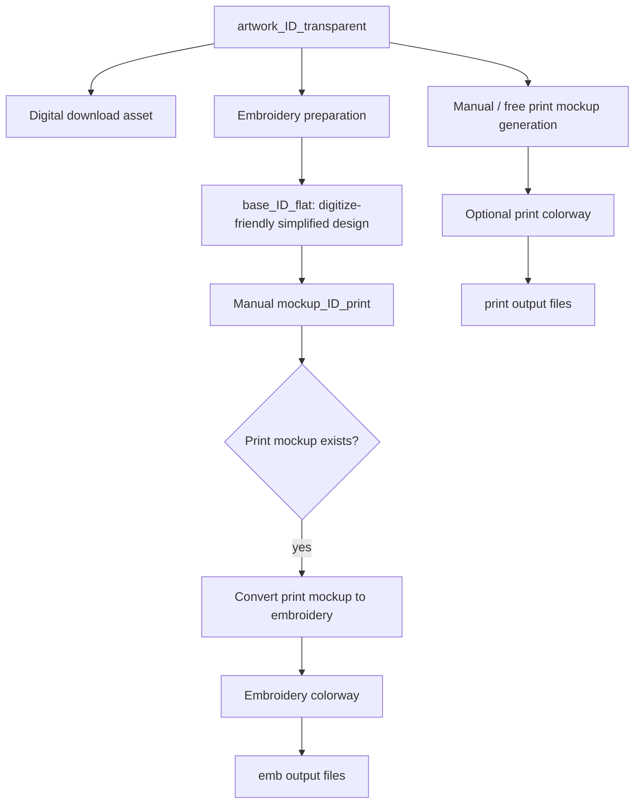
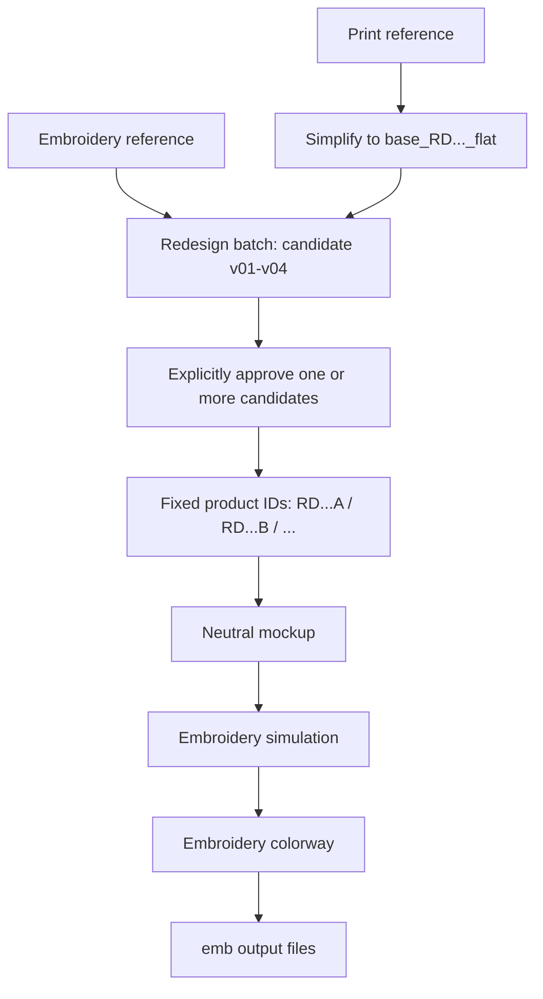

# Endorphin Etsy Workflow Architecture

This document is the handoff specification for the next Etsy workflow redesign.
It records the agreed asset structure, naming rules, and the intended behavior of
the supporting Endorphin nodes.

## Goals

- Keep the **idea/artwork** and **redesign** businesses independent while using a
  consistent delivery structure.
- Separate digital-print assets from embroidery assets.
- Batch colorways without manually typing IDs, paths, or filenames repeatedly.
- Use **Endorphin Etsy Color Palette** as the colorway source of truth. The
  older general palette picker remains available only for legacy workflows.
- Prevent colorway from running against an unapproved redesign candidate.

## Root layout

```text
G:\My Drive\_Etsy\_Listing\
├─ artwork\
│  └─ <ARTWORK_ID>\
└─ redesign\
   └─ <REDESIGN_BATCH_ID>\
```

`legacy\` may be retained beside these folders for old listings. It is not part
of the new workflows.

## Identifiers

### Artwork IDs

Artwork IDs are assigned by the person supplying the idea and remain independent
from redesign IDs. Example: `2608001`.

The canonical source artwork is named `artwork_<ARTWORK_ID>`.

The Project Selector scans all existing direct project folders into an ID
picker; `Refresh` rescans that unfiltered list and removes a selected ID when
its folder no longer exists. Its `+ New` action has separate compact `Year` and
`Month` dropdowns (placed before the ID picker), joins them as `YYMM`, then
creates the lowest unused `YYMMNNN` folder ID. Those dropdowns affect only
`+ New`, never the scan. This does not replace the idea owner's authority to
choose the artwork ID. When an externally assigned ID is needed, create that
correctly named folder outside ComfyUI and press `Refresh`.

### Redesign IDs

Each redesign reference batch receives an internally assigned ID:

```text
RD2608001
```

There are no hyphens. This batch ID represents the source/reference lineage; it
is not itself a sellable candidate/SKU.

Candidate letters are exploration slots before approval. When a candidate is
approved, its letter becomes the permanent suffix of the sellable design ID:

```text
RD2608001A
RD2608001B
RD2608001C
```

The slot-to-product mapping is fixed; approval never renames or reorders it:

```text
candidate slot A (v01) = RD2608001A
candidate slot B (v02) = RD2608001B
candidate slot C (v03) = RD2608001C
candidate slot D (v04) = RD2608001D
```

If only candidate 2 is approved, it remains `RD2608001B`. Before approval, a
deleted candidate releases its slot for a new exploration candidate. After
approval, that letter is permanently bound to its product identity and can never
be reused for a different design.

## Workflow A — Idea / Artwork

Project Selector routes are `artwork_foundation`, `artwork_stitchwork`, and
`artwork_colorway`; only the selected route is intended to be evaluated.

### Artwork stages

```text
Foundation: artwork_<ID>_transparent -> base_<ID>_transparent
Stitchwork: base_<ID>_print -> base_<ID>_emb
Colorway:   base_<ID>_emb -> colored mockup outputs
```

`base_<ID>_print` is a deliberate manual handoff. Selecting Stitchwork before
that file exists must fail with the expected path and must not invoke an image
generation node.

Artwork may be generated directly with transparency; an opaque original is
optional rather than required. The resulting artwork produces three deliberately
separate branches.



Important rules:

1. `artwork_<ID>_transparent` is the canonical artwork asset and the
   digital-download product asset.
2. `mockup_<ID>_print` is prepared manually. Its existence is an explicit gate
   before any artwork-to-embroidery conversion runs.
3. The print-mockup branch can otherwise be generated freely from the artwork;
   it does **not** have to use the embroidery process.
4. The embroidery branch is controlled: simplify to `base` where needed, use
   the approved manual print mockup, convert it to embroidery, then colorway.
5. `print` and `emb` are separate output folders. Do not make one color folder
   per color; color variants live directly in each output folder.

### Artwork folder example

```text
artwork\
└─ 2608001\
   ├─ artwork_2608001.png
   ├─ artwork_2608001_transparent.png
   ├─ base_2608001_flat.png
   ├─ mockup_2608001_print.png              # prepared manually
   ├─ print\
   │  ├─ mockup_2608001_C01_mocha-taupe_print.png
   │  └─ mockup_2608001_C02_soft-white_print.png
   └─ emb\
      ├─ mockup_2608001_C01_mocha-taupe_emb.png
      └─ mockup_2608001_C02_soft-white_emb.png
```

`mockup_<ID>_neutral` is an embroidery working asset, not a required input to
the print branch.

## Workflow B — Redesign for embroidery

Project Selector routes are `redesign_emb_candidate`,
`redesign_print_candidate`, and `redesign_colorway`. Print candidate generation
includes simplification in its candidate prompt; it has no separate simplify
stage.

## Target minimal node architecture

The intended end state is **two public Etsy nodes**, not a chain of selector,
stage, source-loader, candidate-loader, and palette nodes.

### 1. Endorphin Etsy Project Selector

This is the project control panel. It owns project-folder selection and the
currently selected route. It exposes a common `context` metadata output for
file operations plus one selected route token; route outputs are available for
open, user-wired branches:

```text
artwork_foundation
artwork_stitchwork
artwork_colorway
redesign_emb_candidate
redesign_print_candidate
redesign_colorway
```

The UI progressively reveals only valid choices. Artwork shows its three
stages. Redesign shows Candidate or Colorway; Candidate then chooses Embroidery
Reference or Print Reference. The two redesign source types are independent
routes, not ordered stages. Print Reference performs simplification inside its
candidate-generation prompt; it does not persist a separate simplify asset.

For `redesign_colorway`, the Selector also owns candidate selection: it lists
available candidates, previews the selected candidate, and can approve it.
The resulting context carries `product_id` and the selected candidate path.

The Etsy Color Palette is integrated into this Selector and shown only on
Colorway routes. The selected row contributes `color_name`, `color_hex`, and
`color_code` to context. For queue batching, a separate `color_index` control
(for example the existing Auto Reset Int) determines which palette row is used
for a given queue item; the palette editor remains the durable editable source
of all color data.

### 2. Endorphin Etsy Stage Save

One output node receives `images` and `context`. Prefix and suffix use fixed
dropdown conventions rather than arbitrary text:

```text
prefix: artwork / base / mockup / candidate
suffix: none / transparent / print / emb
```

Colorway uses `color_code` from context when constructing its filename. Choosing
the `candidate` convention for a Redesign context uses the alphabetical
allocator: it scans persisted candidates, fills missing unapproved letters
first, and never reuses an approved letter.

## Routing requirement

Selector route outputs alone do not stop ComfyUI evaluation. Each eventual
branch merge/save must use lazy inputs keyed by the selected route, so ComfyUI
requests only the active Artwork/Redesign route and only its selected stage.

Redesign creates only embroidery outputs. It intentionally has no print branch.



### Reference modes

| Source type | Rule |
| --- | --- |
| `embroidery_reference` | A shirt/design already suitable for embroidery. It may go directly into the redesign batch. |
| `print_reference` | A printed shirt or print-oriented graphic. It first goes through an explicit simplification step that outputs `base_<RD_BATCH_ID>_flat`; only then can it enter the embroidery redesign batch. |

Do not make `print_reference` an invisible alternate mode of the normal redesign
workflow. Keeping its preparation stage explicit prevents print-only texture,
gradients, and fine detail from contaminating the stable embroidery workflow.

### Raw references have no naming convention

Reference images may arrive with arbitrary names. Do not rename them manually or
require the sender to follow an Endorphin convention. The project folder provides
the identity; derived assets start using the `RD...` naming convention.

```text
redesign\
└─ RD2608001\
   ├─ source\
   │  └─ supplier-image-final (3).jpg       # arbitrary original filename
   ├─ base_RD2608001_flat.png                # only for print_reference
   ├─ candidate_RD2608001A.png
   ├─ candidate_RD2608001B.png
   ├─ candidate_RD2608001C.png
   ├─ candidate_RD2608001D.png
   ├─ RD2608001A\
   │  ├─ mockup_RD2608001A_MTP.png
   │  └─ mockup_RD2608001A_SWH.png
   └─ RD2608001B\
      └─ mockup_RD2608001B_MTP.png
```

## Candidate approval rule

Colorway must never select a candidate implicitly or use an unapproved
candidate. The candidate index already determines its product ID; approval only
records which existing candidates may proceed:

```text
candidate slot A -> RD2608001A
candidate slot B -> RD2608001B
candidate slot C -> RD2608001C
candidate slot D -> RD2608001D
```

The candidate file is also that candidate's neutral/master asset. Approval
does not duplicate it as a separate `mockup_..._neutral` file; it only grants
the fixed product ID permission to enter Colorway.

The operator can approve multiple candidates, for example `B` and `D`. Only
approved IDs appear in the downstream colorway picker/loader. If none has been
approved, the workflow should show a clear validation error rather than silently
processing candidate 1.

### Candidate slot lifecycle

```text
unapproved slot  -> reusable exploration slot
approved slot    -> permanently locked product identity
```

Operational rules:

1. An existing candidate asset is never silently overwritten.
2. A deliberately deleted, unapproved slot may be filled by a newly generated
   candidate.
3. Candidate generation fills reusable unapproved gaps first, then uses the next
   available letter (`E`, `F`, ...) when no gap is available.
4. Missing unapproved candidates are valid. A missing approved candidate or its
   required approved/master asset is a validation error.
5. Approval resolves the candidate currently persisted on disk. It must not
   approve an old IMAGE reference still held by the graph/UI.
6. Approval does not mean every downstream asset already exists. Each downstream
   stage validates the specific asset it requires and must not release a locked
   letter when that asset is missing.

### Alphabetical candidate auto-increment

`Endorphin Etsy Candidate Save` behaves like an auto-increment node, but its counter
is alphabetical rather than numeric:

```text
A -> B -> C -> D -> E -> F -> ...
```

It must allocate a slot when each generated image is saved, not assume a fixed
batch count. Therefore a ComfyUI batch/queue of two saves `A`, then `B`; a batch
of four saves `A` through `D`; a later queue resumes at the next available slot.
If one execution returns an IMAGE batch, allocation follows the image order
within that batch.

For every image, the node performs this allocation:

```text
1. Read project.json to find approved/locked letters.
2. Scan the redesign project folder for existing candidate files.
3. Starting at A, choose the first letter that is neither locked nor occupied.
4. Save the image and expose its letter, product_id, and path as outputs.
```

This makes the node state-aware rather than a volatile UI counter. For example,
an unapproved `C` whose candidate file was deleted becomes available again;
approved `A` remains permanently skipped. Candidate files use the unambiguous
form:

```text
candidate_RD2608001A.png
candidate_RD2608001B.png
```

The allocator should reserve a selected slot before writing its file so that two
near-simultaneous saves cannot choose the same letter.

### Project manifest

The filesystem remains the source of the actual assets. Each project also keeps
a small `project.json` manifest for state that cannot safely be inferred from a
filename, especially source type and approval state. Nodes create and update it;
the operator should not normally need to edit it by hand.

```json
{
  "schema_version": 1,
  "project_id": "RD2608001",
  "source_type": "print_reference",
  "approved_candidates": ["B", "D"]
}
```

This lets the Colorway Loader safely discover `RD2608001B` and `RD2608001D`
after the workflow has been closed and reopened.

## Colorway convention

**Endorphin Etsy Color Palette** remains editable: colors can be added, edited,
deleted, and reordered for a specific listing. It is the canonical color list.

Recommended output fields for each colorway are:

```text
colorway_index   C01, C02, ...
color_name        mocha taupe
color_slug        mocha-taupe
color_hex         #977D67
color_code        MTP
prompt_color      optional exact prompt text/override
```

`prompt_color` resolves to the generated default (for example `mocha taupe (hex
#977D67)`) unless that particular palette row has an explicit prompt override.
That removes the need to duplicate the color list in **Endorphin Text Lines** and
**Endorphin Switch Case**, while retaining the ability to use different text in
the generation prompt when needed.

### Color code and SKU handoff

`color_code` is a required, stable three-letter uppercase code stored directly
in the Etsy Color Palette row. It is an image-pipeline SKU component, unlike
`colorway_index` (`C01`, `C02`, ...) which only describes the current palette
order and may change when rows are reordered.

```text
mocha taupe  | #977D67 | MTP
soft white   | #D9DADE | SWH
black navy   | #272A37 | BNV
```

The picker may suggest a code deterministically from the color name; no AI is
needed. It should take initials from up to three words and use a simple fallback
from the word itself to reach three letters (`cream` -> `CRM`, `sand` -> `SND`).
The operator may edit the suggestion.

Rules:

1. A code is exactly three uppercase letters (`A-Z`).
2. It must be unique inside the active palette.
3. Renaming a color, changing its hex value, or reordering rows must not
   automatically change an existing code.
4. A duplicate or invalid code should be shown as a validation error for the
   operator to resolve; it must not silently generate a different SKU code.

Color field semantics are deliberately separate:

```text
color_name      human-readable color intent
color_code      stable machine identity
color_hex       editable generation/tuning parameter
colorway_index  current palette/batch order only
```

Changing a hex value to improve a generation must not change `color_name` or
`color_code`. Two rows may intentionally share a name or hex value; only their
`color_code` values must be unique within the active palette.

The image workflow outputs only the two stable SKU components it owns. Garment
type, garment color, size, and all final-SKU assembly belong to the separate
selling system:

```text
product_id: RD2608001B
color_code: MTP
```

Suggested image filename:

```text
mockup_RD2608001B_C01_MTP_mocha-taupe_emb.png
```

`C01` is retained for batch readability; `MTP` is the stable color component of
the image-production identity. The downstream selling system receives
`product_id` and `color_code`, then combines them with garment, size, and its
other required fields to form the final SKU.

The following is an implementation invariant:

```text
product_id + color_code = one unique image-production color variant
```

For example, `RD2608001B + MTP` always identifies the mocha-taupe asset variant
for product `RD2608001B`. `colorway_index` is not part of this identity. Asset
savers should use this key for overwrite detection, duplicate detection, asset
lookup, and safely resuming a colorway batch.

An output filename's color slug is a descriptive snapshot at generation time,
not identity. Renaming a palette color affects newly generated filenames only;
it must not rename old output files.

When an asset already exists for the same `product_id + color_code`, the Save
node should offer an explicit `on_existing` behavior:

```text
Replace existing
Fail if exists
Skip if exists
```

The identity remains the same in all three cases. The choice is operational:
`Replace` is useful after tuning a prompt or hex value, while `Fail`/`Skip` are
useful for a conservative batch run.

Switch Case remains useful for non-color conditional logic; it should not be the
second source of truth for palette names or hex values.

## Intended Endorphin node roles

These are design targets for the next node/workflow pass, not all necessarily
implemented yet.

| Node / capability | Responsibility |
| --- | --- |
| Etsy Project Selector | One fixed clickable card UI: choose Artwork or Redesign, choose Year and Month only when creating a new ID, then select an existing ID from an unfiltered scanned picker. It shows either the one Artwork source or the two applicable redesign-reference sources, with `Refresh` and a `+ New` quick-folder action. It creates canonical context. |
| Etsy Workflow Stage | Select `Prepare`, `Approve`, or `Colorway` and enable only the corresponding output branch. |
| Etsy Lazy Workflow Router | Accept lazy Artwork and Redesign image inputs, requesting only the branch chosen in context so the other branch is not evaluated. |
| Etsy Source Asset Loader | Resolve and load the source automatically: `artwork_<ID>` for artwork projects, or the first source file in `redesign/<RD_ID>/source/` for redesign projects. |
| Etsy Asset Loader | Load a stage asset such as artwork, base, neutral mockup, or an approved candidate. |
| Etsy Candidate Save | Save generated redesign candidates with state-aware alphabetical auto-increment (`A`, `B`, `C`...), never overwriting an occupied or approved slot. |
| Etsy Approve Redesign Candidate | Mark one or more fixed candidates `A/B/C...` as approved in `project.json`. It must require an explicit selection and never renumber candidates. |
| Etsy Batch Loader | Iterate approved projects/candidates for a chosen stage; do not use it to iterate all variants in one `print` or `emb` folder. |
| Etsy Asset Save | Receive context plus palette fields and generate the correct folder/filename automatically. |
| Etsy Color Palette | Canonical editable colorway data, three-letter color code, and prompt override. |
| Folder Image Loader | Iterate multiple images already inside one `print` or `emb` folder. |
| Subfolder Image Loader | Iterate one selected matching image per project/leaf folder; useful for project-level batch discovery, not multiple color files in the same folder. |

`ENDORPHIN_ETSY_CONTEXT` is the versioned canonical metadata contract between
Etsy-aware nodes. It carries workflow type, project ID, selected
candidate/product ID, source type, asset stage, project root, and resolved paths
between these nodes. It should not carry transient image payloads or the whole
palette: images remain `IMAGE` links and the Etsy Color Palette remains the colorway
source of truth. Context avoids retyping paths and protects against mixing
artwork and redesign IDs.

All Etsy-aware nodes use shared normalization and validation rules: identifiers
and color codes compare case-insensitively, while canonical manifest storage and
generated output use uppercase (`rd2608001b` -> `RD2608001B`, `mTp` -> `MTP`).
No node may infer a project ID or product ID from an arbitrary user-supplied
source filename; identity comes from the Project Picker, project folder, and
context/manifest only.

## One workflow, separate execution stages

The canvas may contain all three stages, but colorway must not run while the
operator is still preparing or reviewing a design:

```text
Prepare  -> creates source/base/candidates and saves working assets
Approve  -> records approved candidate letters in project.json
Colorway -> loads only approved assets from disk and produces variants
```

The Colorway branch must load its approved master asset from disk, rather than
being wired directly to the candidate-generation output. This is the execution
and approval boundary.

Each branch ends in an Endorphin conditional output/save node whose image input
is lazy. With `run_stage = Prepare`, for example, the inactive Colorway save node
does not request its image input; ComfyUI therefore does not traverse upstream
to RH or any other image-generation node in that branch. This keeps all stages
in one workflow without manually disabling the inactive image-generation branch.

## Migration and compatibility

- Keep the existing old redesign workflow functional while new nodes are added.
- New IDs must accept strings, not only numeric `listing_number` values, because
  `RD2608001A` is a valid product ID.
- Existing generic loaders remain useful; do not force the new Etsy process to
  use Subfolder Image Loader when the older workflow already has better-fitting
  Etsy listing nodes.
- Build the new project/context/picker nodes before replacing existing nodes.
